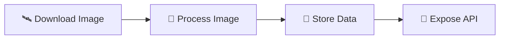

# 🛰️ Service Satellite - AquaWatch

> **Analyse d'images satellites pour la qualité de l'eau**

**Version:** 1.0.0 | **Stack:** Python + FastAPI | **Développeur:** Bilal KHANTOURI

---

## 🎯 C'est quoi ce service?

Ce service **télécharge et analyse des images satellites** pour détecter la qualité de l'eau:

🌊 **NDWI** → Détecte l'eau  
🌿 **Chlorophylle** → Mesure les algues  
🔍 **Turbidité** → Évalue la clarté  

### 📡 Pour qui?
- **Hamza (STModel)** → Données pour Machine Learning
- **Yassin (API-SIG)** → Positions GPS pour cartes

---

## 📁 Structure Simple

```
service_satellite/
├── 🎯 main.py              → Lance l'API
├── ⚙️  config/             → Connexions (MongoDB, MinIO, Sentinel)
├── 📝 models/              → Validation des données
├── 🛣️  routes/             → Endpoints API
└── 🔧 services/            → Téléchargement + Traitement images
```

**Comment ça marche?**
1. **Download** → Télécharge image Sentinel-2
2. **Process** → Calcule indices (NDWI, Chloro, Turbidité)
3. **Store** → Sauvegarde dans MinIO + MongoDB
4. **API** → Expose les données

---

## 🚀 Démarrage en 3 étapes

### **Étape 1: Lancer l'infrastructure**
```powershell
docker compose up db_satellite minio_storage redis_queue -d
```

### **Étape 2: Build + Démarrer le service**
```powershell
docker compose build service_satellite
docker compose up service_satellite
```

### **Étape 3: Tester 🎉**
```powershell
curl http://localhost:8002/health
```

**✨ Accès rapides:**
- 📊 API Docs: http://localhost:8002/docs
- 🗂️ MinIO Console: http://localhost:9001 (admin/aquawatch123)
- ✅ Health: http://localhost:8002/health

---

## 📡 Les 3 APIs Principales

### **1️⃣ Health Check** ✅
**Vérifier si le service fonctionne**

```bash
GET http://localhost:8002/health
```

**Retour:**
```json
{
  "status": "ok",
  "mongodb": "connected",
  "minio": "connected"
}
```

---

### **2️⃣ Derniers Indices** 🎯 ← **Important pour Hamza**
**Récupérer les données satellites pour ML**

```bash
GET /api/satellite/indices/latest?limit=10&hours=24
```

**Paramètres:**
- `limit`: Combien d'indices (1-100, défaut: 10)
- `hours`: Depuis combien d'heures (1-720, défaut: 24)

**Exemple de réponse:**
```json
{
  "success": true,
  "count": 2,
  "indices": [
    {
      "image_id": "SAT001",
      "zone": {
        "latitude": 33.5731,
        "longitude": -7.5898,
        "rayon_km": 5
      },
      "indices": {
        "chlorophylle": 0.8,           // mg/m³
        "turbidite_satellite": 15.2,   // NTU
        "temperature_surface": 23.1,   // °C
        "ndwi": 0.45                   // -1 à 1
      },
      "timestamp": "2025-11-24T10:00:00Z"
    }
  ]
}
```

---

### **3️⃣ Liste Images** 📋
**Voir toutes les images satellites**

```bash
GET /api/satellite/images?skip=0&limit=10
```

**Retour:**
```json
{
  "success": true,
  "total": 25,
  "count": 10,
  "images": [...]
}
```

---

## 🔬 Les Indices Expliqués Simplement

### 🌊 **NDWI** - Détecteur d'Eau
```
NDWI = (Green - NIR) / (Green + NIR)
```
- ✅ **NDWI > 0** → C'est de l'eau!
- ❌ **NDWI < 0** → Sol ou végétation

---

### 🌿 **Chlorophylle** - Niveau d'Algues
- **Plus haut = Plus d'algues**
- Unité: mg/m³
- Bon pour détecter pollution biologique

---

### 🔍 **Turbidité** - Clarté de l'Eau
- **Plus haut = Eau trouble**
- Unité: NTU
- Mesure la pollution par particules

---

### 🌡️ **Température** (Bientôt)
- À implémenter
- Nécessite bandes thermiques Landsat

---

## ⚙️ Configuration (Variables d'environnement)

```env
# 🚀 Application
PORT=8000

# 🗄️ MongoDB
MONGODB_URL=mongodb://satellite_user:satellite_pass@db_satellite:27017/satellite_db

# 📦 MinIO (Stockage images)
MINIO_ENDPOINT=minio_storage:9000
MINIO_ACCESS_KEY=admin
MINIO_SECRET_KEY=aquawatch123

# 🛰️ SentinelHub (Optionnel - Phase 2)
SENTINEL_CLIENT_ID=your_client_id
SENTINEL_CLIENT_SECRET=your_client_secret
```

**🗂️ Accès MinIO:** http://localhost:9001 (admin/aquawatch123)

---

## 🛠️ Technologies Utilisées

| Catégorie | Outil | Rôle |
|-----------|-------|------|
| 🌐 **API** | FastAPI + Uvicorn | Serveur web rapide |
| 🗄️ **Database** | MongoDB + PyMongo | Stockage métadonnées |
| 📦 **Storage** | MinIO | Stockage images (S3) |
| 🛰️ **Satellite** | SentinelHub API | Téléchargement Sentinel-2 |
| 🔬 **Traitement** | GDAL + Rasterio + NumPy | Calcul indices |
| ⚡ **Queue** | Redis | Tâches asynchrones |

---

## 💻 Code Rapide - Comment Utiliser

### **Télécharger une image**
```python
from app.services.download import SentinelDownloader

downloader = SentinelDownloader()
image = downloader.download_image(33.5731, -7.5898, 5.0)
# ↓ Retourne image 512x512 avec 4 bandes
```

### **Calculer les indices**
```python
from app.services.processing import ImageProcessor

indices = ImageProcessor.process_sentinel_image(image)
# ↓ {'ndwi': 0.45, 'chlorophylle': 0.8, 'turbidite': 15.2}
```

### **Sauvegarder dans MongoDB**
```python
from app.config.database import Database

db = Database.get_db()
db.satellite_images.insert_one({
    "image_id": "SAT001",
    "zone": {"latitude": 33.5731, "longitude": -7.5898},
    "indices": indices,
    "timestamp": datetime.utcnow()
})
```

### **Uploader dans MinIO**
```python
from app.config.storage import MinIOStorage

client = MinIOStorage.get_client()
client.fput_object("satellite-images", "SAT001.tiff", "image.tiff")
```

---

## 🔄 Workflow en 3 Étapes



**1️⃣ Download** → Sentinel-2 image  
**2️⃣ Process** → Calcul NDWI, Chloro, Turbidité  
**3️⃣ Store** → MinIO (image) + MongoDB (indices)  
**4️⃣ API** → Hamza & Yassin récupèrent les données

---

## 🧪 Tests Rapides

### **✅ Tester avec curl**
```bash
curl http://localhost:8002/health
curl http://localhost:8002/api/satellite/images
curl "http://localhost:8002/api/satellite/indices/latest?limit=5"
```

### **📊 Swagger UI (Recommandé)**
Ouvre http://localhost:8002/docs et teste directement!

### **📝 Voir les logs**
```powershell
docker compose logs -f service_satellite
```

---

## 🐛 Problèmes Courants & Solutions

| Problème | Solution |
|----------|----------|
| ❌ Service ne démarre pas | `docker compose logs service_satellite` puis rebuild |
| ❌ MongoDB connection failed | `docker compose restart db_satellite` |
| ❌ MinIO error | Vérifier http://localhost:9001 |
| ❌ Module not found | `docker compose build --no-cache service_satellite` |

**Commandes debug:**
```powershell
# Voir erreurs
docker compose logs service_satellite

# Rebuild complet
docker compose build --no-cache service_satellite

# Restart tout
docker compose restart
```

---

## 📊 Structure MongoDB

**Collection:** `satellite_images`

```json
{
  "image_id": "SAT001",
  "zone": {
    "latitude": 33.5731,
    "longitude": -7.5898,
    "rayon_km": 5
  },
  "timestamp": "2025-11-24T10:00:00Z",
  "source": "Sentinel-2",
  "indices": {
    "chlorophylle": 0.8,
    "turbidite_satellite": 15.2,
    "ndwi": 0.45
  },
  "file_path": "satellite-images/SAT001.tiff",
  "processed": true
}
```

---

## 🎯 Roadmap

| Phase | Statut | Tâches |
|-------|--------|--------|
| **Phase 1** ✅ | Terminé | API de base, MongoDB, MinIO, Health |
| **Phase 2** ✅ | Terminé | Download, Processing, Calcul indices |
| **Phase 3** 🔄 | En cours | Pipeline complet, Tests, Scheduler |
| **Phase 4** 📝 | Prévu | Auth, Rate limit, Dashboard temps réel |

---

## 🤝 Intégration Facile

### **Pour Hamza (Machine Learning)**
```python
import requests

response = requests.get(
    "http://service_satellite:8000/api/satellite/indices/latest",
    params={"limit": 10, "hours": 24}
)

indices = response.json()["indices"]
# ↓ Utiliser pour ton modèle ML
```

### **Pour Yassin (Cartes SIG)**
```python
import requests

response = requests.get(
    "http://service_satellite:8000/api/satellite/images"
)

images = response.json()["images"]
# ↓ Afficher positions sur carte
```

---

## 📌 Notes Techniques

### **Bandes Sentinel-2**
| Bande | Longueur d'onde | Utilisation |
|-------|-----------------|-------------|
| B02 (Blue) | 490 nm | Détection eau |
| B03 (Green) | 560 nm | Végétation aquatique |
| B04 (Red) | 665 nm | Chlorophylle, turbidité |
| B08 (NIR) | 842 nm | Biomasse, NDWI |

### **⚠️ Limites Actuelles**
- Température nécessite Landsat (bandes thermiques)
- SentinelHub credentials requis pour téléchargement
- Traitement synchrone (async prévu Phase 3)

---

## 📞 Contact & Support

**👨‍💻 Développeur:** Bilal KHANTOURI  
**🌿 Branche:** `dev_Bilal`  
**📅 Version:** 1.0.0 (24 Nov 2025)  
**🎓 Projet:** EMSI 2025 - AquaWatch

---

<div align="center">

**🚀 Service Satellite - Production Ready!**

Made with ❤️ for clean water monitoring

</div>
